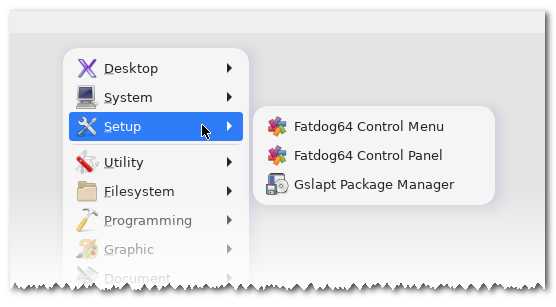

# gmenu3

GTK XDG Application Menu for Fatdog64 Linux.

Homepage: <https://github.com/step-/gmenu3>.



## Description

Gmenu3 reads a menu specification file conforming to the [XDG Menu
Specification], and displays the corresponding pop-up Application
Menu. On [Fatdog64 Linux] gmenu3 can replace the Application
Menu provided by the Desktop panel and the Openbox window manager.

> The implementation of the XDG Menu Specification is partial;
> just enough to fully support [Fatdog64 Linux].

## Features

In addition to the standard Application Menu categories,
gmenu3 offers the following optional features:

- Recently-used submenu.
- Fixed screen position.
- Search app entry.
- Embedding the Fatdog64 Control Panel as a submenu.
- Disabling icons or changing the icon size.
- Changing the font family, color, and size of labels and tooltips.
- Wine submenu (if [Wine] is installed and properly configured).

[Fatdog64 Linux]: <https://distro.ibiblio.org/fatdog/web/>
[Wine]: <https://www.winehq.org>
[XDG Menu Specification]: <https://specifications.freedesktop.org/menu-spec/latest/>

## Installing

Gmenu3 is a shell script. It depends on several
commands that come preinstalled in Fatdog64 Linux:

- [gtkmenuplus] >= 2.2.0 [>903]
- [makesymlinks] [>903]
- [findnrun] [=903] is preconfigured as the Search app (can be changed).
- gawk, find, realpath, sed, xargs.

> [>903] Preinstalled in Fatdog64 versions after 903.  
> [=903] Preinstalled in Fatdog64-903.  

[gtkmenuplus]: <https://github.com/step-/gtkmenuplus>
[makesymlinks]: <https://github.com/step-/makesymlinks>
[findnrun]: <https://github.com/step-/find-n-run>

A basic Makefile is provided to install the script and its manual page:

```sh
    make PREFIX=/usr/local all install
```

## Usage

Usage is straightforward; this is just a popup menu, after all:

```sh
    gmenu3 [options]
```

pops up the menu. There are some command-line options to manage the cache; refer
to the [manual page]. User preferences are initialized automatically the first
time gmenu3 is used. Have a look at the [sample configuration file] to see which
optional features can be enabled.

[manual page]: <https://github.com/step-/gmenu3/blob/main/doc/usage.md>
[sample configuration file]: <https://github.com/step-/gmenu3/blob/main/doc/gmenu3-sample.env>

## Support

Report bugs at <https://github.com/step-/gmenu3/issues>.
